Final-year B.E. Computer Science (AI/ML) student working on deep learning: computer vision, NLP and LLM systems. I fine-tune and evaluate models, from vision transformers for satellite imagery to YOLO11 for detection and tracking, and then build the pipelines and applications that put them to use.

[LinkedIn](https://www.linkedin.com/in/vatsal-mehta-/)

## Projects

###  [CityTraceAI](https://github.com/code-YK/ANPR-sih26) · multi-camera ANPR and vehicle tracking

A vision pipeline that reads number plates across a city's cameras: a fine-tuned YOLO11 detector, a multi-object tracker, and plate OCR with per-track character voting, so a plate is recorded only once its read settles. The confirmed reads feed one observation store that reconstructs vehicle journeys across cameras, raises watchlist alerts and drives traffic analytics. Team project for Smart India Hackathon 2026 (problem statement SIH26127, Bharat Electronics Limited). I built the pipeline, the backend and operator console, and a tool-calling LLM copilot.

`YOLO11` `Multi-object tracking` `OCR` `ONNX Runtime` `OpenCV` `FastAPI` `PostGIS` · [Demo video](https://youtu.be/L4I-Z-sIcUU)

###  [UrbanEye](https://github.com/VatsalMehta-0523/Satellite-Imagery-Change-Detection) · satellite change detection

Fine-tuned ChangeFormerV6, a Siamese transformer, on Sentinel-2 imagery (OSCD) to map urban land-use change between two dates. The pipeline adds six spectral indices (NDVI, NDBI, NDWI and others) and a LangGraph agent that runs each stage with human approval. Related work: SegFormer-B0 fine-tuned on DeepGlobe for an ISRO road-extraction problem, best F1 0.80.

`PyTorch` `ChangeFormer` `SegFormer` `Sentinel-2` `LangGraph` · [Demo video](https://youtu.be/ce8-K_piZhI)

###  [NeuroHack](https://github.com/VatsalMehta-0523/NeuroHack) · long-term memory for conversational AI

Extracts facts, preferences and commitments from a conversation, stores them, and uses embedding search to retrieve only the relevant ones into the context window on later turns. Memories decay with time and disuse. Rank 24 of 800+ teams at NeuroHack 2026 (IIT Guwahati).

`LLMs` `Embeddings` `RAG` `pgvector` `Streamlit` · [Live demo](https://neurohack.streamlit.app/)

###  [Security-Copilot](https://github.com/vedant-kalal/Security-Copilot) · agentic phishing and threat detection

Two-tier detection for phishing emails and URLs. A local BERT model gives an instant read; a LangGraph agent then investigates on request (origin trace, SPF/DKIM/DMARC checks, sandboxed links and attachments) and returns a risk-scored verdict. Ships as a Gmail add-on and a Chrome extension. Team project, 1st place at Maveric Effect 2026.

`BERT` `ONNX` `LangGraph` `FastAPI` `Next.js` · [Demo video](https://youtu.be/amZM1H0NQ84)

###  [Meet Attendance Tracker](https://github.com/VatsalMehta-0523/meet-attendance-tracker) · published Chrome extension

My college takes surprise attendance on Google Meet, so I built an extension that catches it. It reads Meet captions and chat on-device, never audio, detects a roll call and sounds an alarm. Used by classmates.

`JavaScript` `Chrome Extension (Manifest V3)` · [Chrome Web Store](https://chromewebstore.google.com/detail/meet-attendance-tracker/hgjmfjempcmmbiipppmmkmoifehbpacb)

### More

- **[ParkSmart](https://github.com/VatsalMehta-0523/parking-system)**: YOLO-based parking slot occupancy detection from surveillance video, with a provider console for bookings and analytics.
- **[Phishing URL detector](https://github.com/VatsalMehta-0523/phishing-url-detector)**: a Streamlit app around a pre-trained BERT phishing classifier. URLs are analysed as text and never visited.
- **[Machine Learning Concepts](https://github.com/VatsalMehta-0523/Machine-Learning-Concepts)**: notebooks covering ML concepts, workflows and model implementations.
- **[Smart Farm](https://github.com/VatsalMehta-0523/smart-farm)**: visitors scan a plant's QR code to explore a botanical farm. Next.js, Supabase. [Live site](https://smart-farm-tau-six.vercel.app)

## Background

- B.E. Computer Science Engineering (AI/ML), New L.J. Institute of Engineering and Technology (GTU), 2023 to 2027. CGPA 9.68/10.
- NPTEL Deep Learning: 100/100, Elite + Gold.
- AI/ML Intern at Meru Technosoft, May to August 2026: a tool-calling LLM chatbot on FastMCP, generative-AI document extraction, and OCR engine benchmarking.
- Three hackathon placements: two first places and one runner-up.

## Stack

**Deep learning:** PyTorch, Hugging Face Transformers, TensorFlow, scikit-learn, fine-tuning and evaluation 
**Computer vision:** YOLO (Ultralytics), multi-object tracking, OCR, ChangeFormer, SegFormer, OpenCV 
**NLP and LLMs:** BERT, embeddings, RAG, vector databases, tool calling, LangGraph 
**Engineering:** Python, SQL, FastAPI, PostgreSQL/PostGIS, React, Google Cloud
